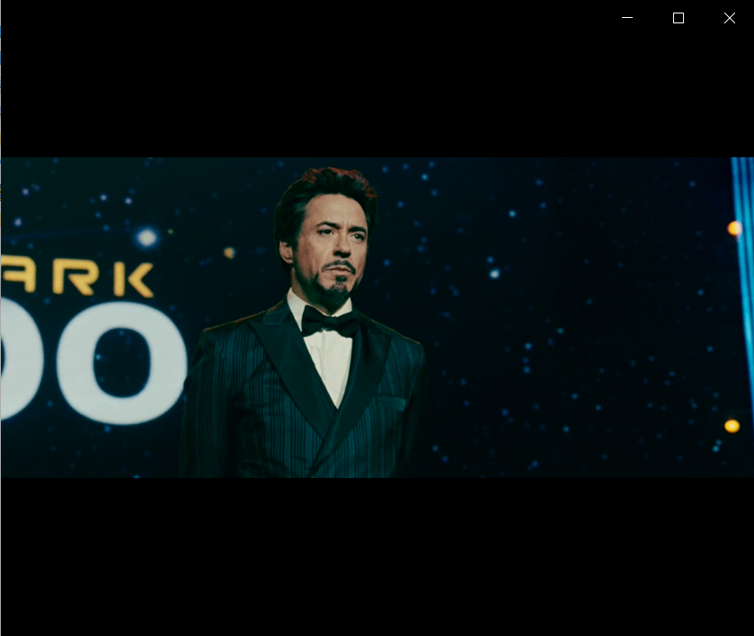
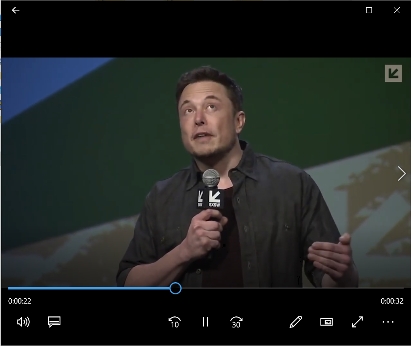
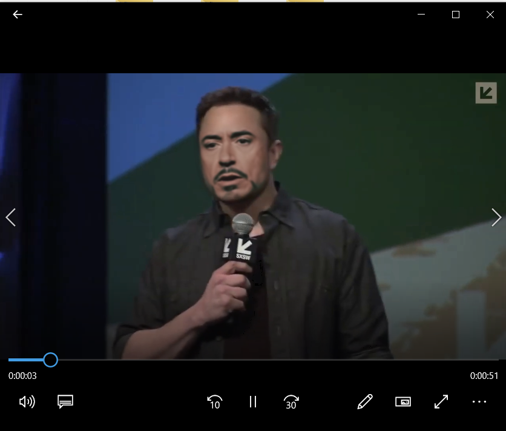

# mini-project-2-base-DFL


## DeepFaceLab  

<a href="https://arxiv.org/abs/2005.05535">
<tr><td colspan=2 align="center">

## Abstract:
  In this mini project we tried to reproduce a face swapping module which is better in terms of masking and quality of picture or video. We used DeepFaceLab to create synthetic data as it gives us the flexibility and opportunity to replace any component in the code which does not meet our requirements. 

## Introduction
  Deepfakes are artificially produced fake content. It involves powerful machine learning algorithms such as generative adversarial networks (GANs), face swapping GAN (FSGANs), CNN, RNN etc. for transferring a source face to the destination while maintaining the destination’s facial movements and expression deformations. 


## Steps to recreate?

 ### Clone the repository
  Steps to reproduce the result and or clone the repository:
  1. Open the command prompt(Windows)/ terminal(Mac) and change to the directory where you want to clone the repo
  2. Command to clone the repo
  
  ```bash

  git clone https://github.com/hsam-2021/mini-project-2-base-DFL.git
```

  3. Download the zipped files dependencies.zip from the google drive and put it in the folder DeepFaceLab as shown in the image below as the file size was large and could not be pushed on github
  ```
  https://drive.google.com/drive/folders/1IRWPWROuGaFFNN1bxyUsgevQjcIh3UqG?usp=sharing
  
  ```
  
  <tr><td align="center" width="50%">
  
  
  4.Download the zipped files workspace.zip from the google drive and put it in the folder structure as shown in the image below:
      <tr><td align="center" width="50%">
      

 
      
  ## Steps to follow:

* Download the compatible zipped file on your machine. In our case windows.
      
* Extract the files.
      
* Clear the workspace (run the 1. clear workspace.bat)
      
* Extract images out of the video: Both for source and destination video.
      
* Run the extract images from video data_src.bat
      
* After this is done in the workspace> data_src folder the 654 images are extracted.
      
* Extract the images from destination video 
      
* Run extract images from video data_dst FULL FPS.bat
      
* After this is done in the workspace> data_dst folder the 1619 images are extracted.
      
* Extract faces from the source which focus only on extracting face region
      
* Run data_src faceset extract.bat 
      
* In the data_src > alignment folder all the extracted faces are saved
      
* Similarly extract faces from destination images
      
* Run data_dst faceset extract
      
* In the data_dst > alignment folder all the extracted faces are saved
      
* If the faces extracted in source and destination are not correct then we can delete the unwanted images using step 
      
* 4.1 data_src view aligned result
      
* Delete all the unwanted images from the folder.
      
* Now that we have clean source and destination images with extracted faces, we will train using train quick96. Here it will ask for model name, and then run the   
  model.
      
* After training for around 60K -70K iteration the output is somewhat of reasonable quality. So will save the model.   
      
      
## Source video
      
  <tr><td align="center" width="50%">
  


## Target Video

<tr><td align="center" width="50%">



## Swapped video

<tr><td align="center" width="50%">



  
## Result Mask
  
<tr><td align="center" width="50%">


## Authors:
 * [Drishti Singh](ds6730@nyu.edu)
 
 * [Harshada Sinha](hs4703@nyu.edu)
 
 * [Vaishnavi Rajput](vr2229@nyu.edu)


## Acknowledgement

We are grateful to Prof. Siddharth Garg, Prof. Arsalan Mosenia and the teaching assistants for their help and support. Their guidance helped us to learn and implement our learnings through this project.


<sub>#deepfacelab #deepfakes #faceswap #face-swap #deep-learning #deeplearning #deep-neural-networks #deepface #deep-face-swap #fakeapp #fake-app #neural-networks #neural-nets #tensorflow #cuda #nvidia</sub>


